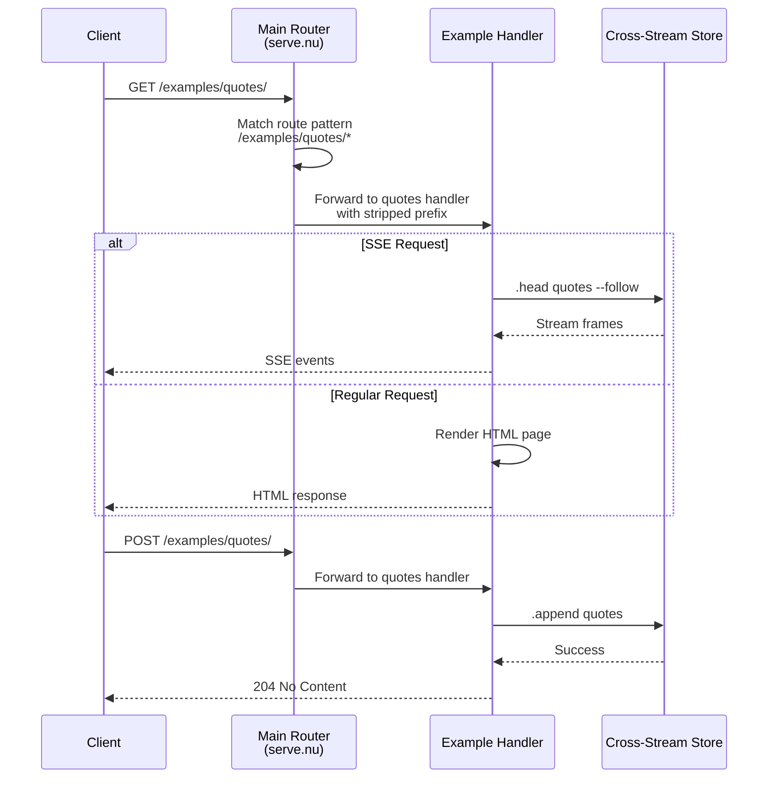
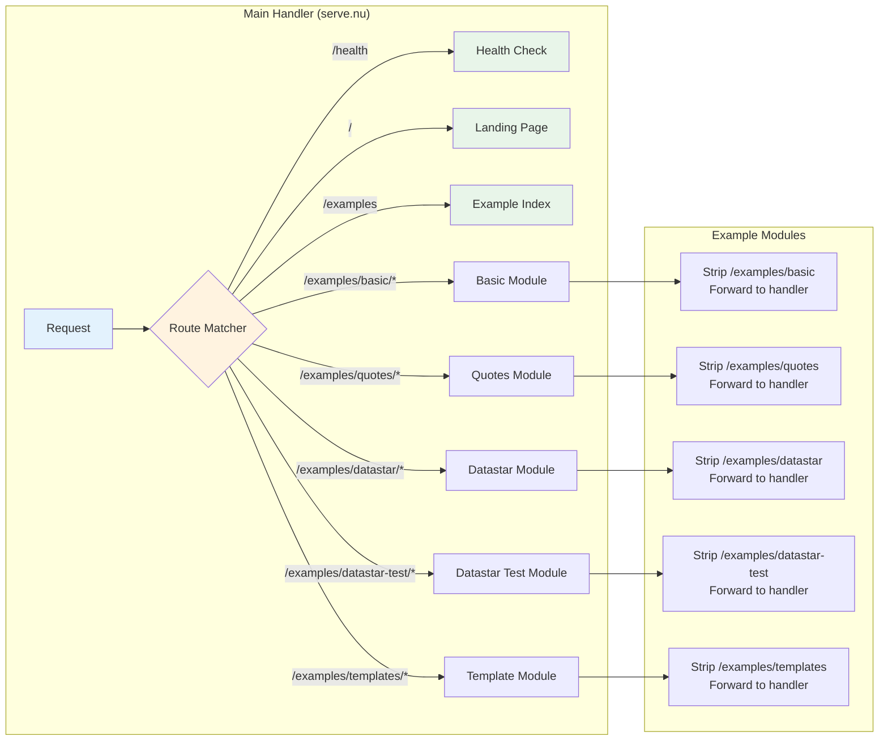
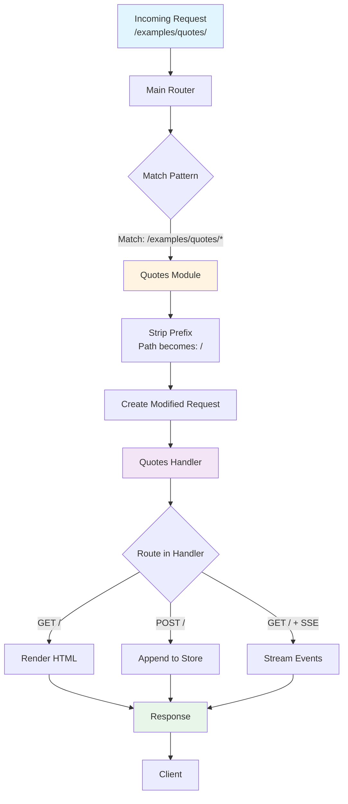
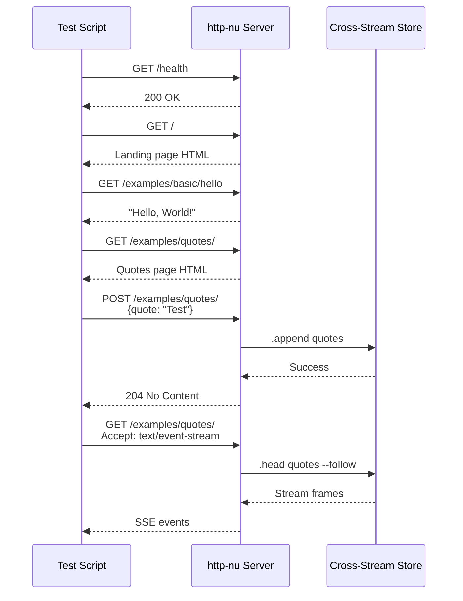
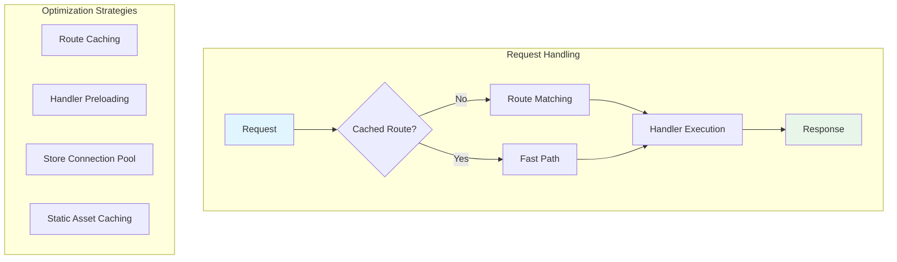
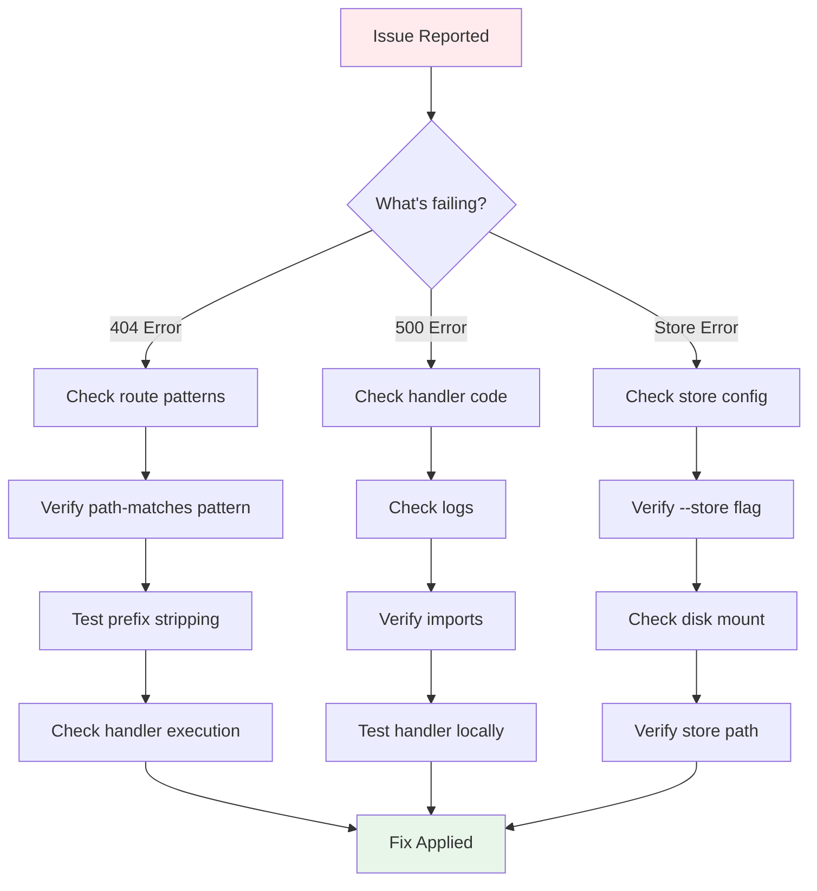

# Multi-Example Endpoint Architecture for http-nu

## Overview

This document describes how to structure the http-nu deployment so that all examples from the `examples/` directory are accessible at their own dedicated endpoints in production. This approach allows showcasing all capabilities of http-nu in a single deployed instance.

## Current Examples Inventory

The http-nu project includes the following examples:

| Example | Type | Description | Dependencies |
|---------|------|-------------|--------------|
| `basic.nu` | Single file | Basic routing and request handling | None |
| `quotes/` | Directory | Live quotes with SSE and Datastar | Store, Datastar SDK |
| `datastar-sdk/` | Directory | Datastar SDK demonstrations | Datastar SDK |
| `datastar-sdk-test/` | Directory | Additional Datastar tests | Datastar SDK |
| `template-inheritance/` | Directory | Minijinja template examples | Template files |

## Architecture Overview

```mermaid
graph TB
    subgraph "Render.com Deployment"
        A[http-nu Server<br/>:$PORT] --> B[Main Router<br/>serve.nu]
        
        B --> C1[/health<br/>Health Check]
        B --> C2[/<br/>Landing Page]
        B --> C3[/examples<br/>Example Index]
        
        B --> D1[/examples/basic/*<br/>Basic Example]
        B --> D2[/examples/quotes/*<br/>Quotes Demo]
        B --> D3[/examples/datastar/*<br/>Datastar SDK]
        B --> D4[/examples/datastar-test/*<br/>Datastar Tests]
        B --> D5[/examples/templates/*<br/>Template Demo]
        
        D1 --> E1[Basic Handler]
        D2 --> E2[Quotes Handler<br/>+ Store]
        D3 --> E3[Datastar Handler]
        D4 --> E4[Datastar Test Handler]
        D5 --> E5[Template Handler]
    end
    
    subgraph "File System"
        F1[examples/basic.nu]
        F2[examples/quotes/serve.nu]
        F3[examples/datastar-sdk/serve.nu]
        F4[examples/datastar-sdk-test/serve.nu]
        F5[examples/template-inheritance/]
    end
    
    E1 -.-> F1
    E2 -.-> F2
    E3 -.-> F3
    E4 -.-> F4
    E5 -.-> F5
    
    style A fill:#e1f5ff
    style B fill:#fff4e1
    style C1 fill:#e8f5e9
    style C2 fill:#e8f5e9
    style C3 fill:#e8f5e9
```

## Request Flow



## Routing Strategy

### Option 1: Prefix-Based Routing with Path Stripping

Each example gets a dedicated prefix (e.g., `/examples/quotes/*`), and the main router strips the prefix before forwarding to the example handler.

**Advantages**:
- Clean separation of concerns
- Examples remain unchanged
- Easy to add/remove examples

**Disadvantages**:
- Requires path manipulation
- More complex routing logic

### Option 2: Sub-Handler Composition

Each example is wrapped in a function that accepts a path prefix and returns a configured handler.

**Advantages**:
- Examples can be aware of their mount point
- Flexible routing
- Easier to share state

**Disadvantages**:
- Examples need modification
- More complex example code

### Option 3: Module-Based Routing (Recommended)

Create a module system where each example exports its routes, and the main router composes them.

**Advantages**:
- Clean, modular architecture
- Examples remain mostly unchanged
- Easy to test individually
- Scalable

**Disadvantages**:
- Requires wrapper modules
- Initial setup complexity

## Implementation: Module-Based Routing

### Directory Structure

```
http-nu/
├── Dockerfile
├── render.yaml
├── serve.nu                    # Main production handler
├── examples/
│   ├── basic.nu
│   ├── quotes/
│   │   ├── serve.nu           # Original handler
│   │   └── module.nu          # Wrapper module (new)
│   ├── datastar-sdk/
│   │   ├── serve.nu
│   │   └── module.nu
│   ├── datastar-sdk-test/
│   │   ├── serve.nu
│   │   └── module.nu
│   └── template-inheritance/
│       ├── serve.nu
│       ├── *.html
│       └── module.nu
└── lib/
    └── example-router.nu      # Shared routing utilities
```

### Architecture Diagram



### Data Flow



## Implementation Code

### 1. Main Handler (serve.nu)

```nushell
# serve.nu - Main production handler with all examples

use http-nu/router *
use http-nu/html *

# Import example modules
use lib/example-router.nu *
use examples/quotes/module.nu as quotes
use examples/datastar-sdk/module.nu as datastar
use examples/datastar-sdk-test/module.nu as datastar-test
use examples/template-inheritance/module.nu as templates

{|req|
  dispatch $req [
    # ========================================================================
    # Core Endpoints
    # ========================================================================
    
    (route {path: "/health"} {|req ctx|
      {status: "ok", version: "0.10.2"}
    })
    
    (route {path: "/"} {|req ctx|
      # Landing page with links to all examples
      HTML [
        (HEAD [
          (META {charset: "utf-8"})
          (TITLE "http-nu Demo")
          (STYLE "
            body { font-family: system-ui; max-width: 800px; margin: 2rem auto; padding: 0 1rem; }
            h1 { color: #333; }
            .example { border: 1px solid #ddd; padding: 1rem; margin: 1rem 0; border-radius: 8px; }
            .example h3 { margin-top: 0; }
            a { color: #0066cc; text-decoration: none; }
            a:hover { text-decoration: underline; }
          ")
        ])
        (BODY [
          (H1 "http-nu Examples")
          (P "Explore the capabilities of http-nu through these interactive examples:")
          
          (DIV {class: "example"} [
            (H3 (A {href: "/examples/basic"} "Basic Example"))
            (P "Simple routing, JSON responses, POST echo, and streaming time")
          ])
          
          (DIV {class: "example"} [
            (H3 (A {href: "/examples/quotes"} "Live Quotes"))
            (P "Real-time quote updates using Server-Sent Events and Datastar")
          ])
          
          (DIV {class: "example"} [
            (H3 (A {href: "/examples/datastar"} "Datastar SDK"))
            (P "Interactive demonstrations of Datastar SDK features")
          ])
          
          (DIV {class: "example"} [
            (H3 (A {href: "/examples/datastar-test"} "Datastar Tests"))
            (P "Additional Datastar SDK test cases")
          ])
          
          (DIV {class: "example"} [
            (H3 (A {href: "/examples/templates"} "Template Inheritance"))
            (P "Minijinja template system with inheritance")
          ])
        ])
      ] | get __html
    })
    
    # ========================================================================
    # Example Routes
    # ========================================================================
    
    # Basic example
    (route {path-matches: "/examples/basic*"} {|req ctx|
      mount-example $req "/examples/basic" (source examples/basic.nu)
    })
    
    # Quotes example (requires store)
    (route {path-matches: "/examples/quotes*"} {|req ctx|
      quotes mount $req "/examples/quotes"
    })
    
    # Datastar SDK example
    (route {path-matches: "/examples/datastar*"} {|req ctx|
      datastar mount $req "/examples/datastar"
    })
    
    # Datastar test example
    (route {path-matches: "/examples/datastar-test*"} {|req ctx|
      datastar-test mount $req "/examples/datastar-test"
    })
    
    # Template inheritance example
    (route {path-matches: "/examples/templates*"} {|req ctx|
      templates mount $req "/examples/templates"
    })
    
    # 404 handler
    (route true {|req ctx|
      "Not Found" | metadata set --merge {'http.response': {status: 404}}
    })
  ]
}
```

### 2. Example Router Utility (lib/example-router.nu)

```nushell
# lib/example-router.nu
# Utilities for mounting examples at specific paths

# Strip a prefix from a request path
export def strip-prefix [prefix: string]: record -> record {
  let req = $in
  let new_path = ($req.path | str replace $prefix "")
  let new_path = if ($new_path | is-empty) { "/" } else { $new_path }
  
  $req | update path $new_path
}

# Mount an example handler at a specific prefix
export def mount-example [
  req: record      # Original request
  prefix: string   # Path prefix to strip
  handler: closure # Handler closure to execute
]: nothing -> any {
  let modified_req = ($req | strip-prefix $prefix)
  do $handler $modified_req
}
```

### 3. Example Module Wrapper (examples/quotes/module.nu)

```nushell
# examples/quotes/module.nu
# Module wrapper for the quotes example

use ../../lib/example-router.nu *

# Mount the quotes example at a given prefix
export def mount [req: record, prefix: string]: nothing -> any {
  let modified_req = ($req | strip-prefix $prefix)
  
  # Source and execute the original handler
  let handler = (source serve.nu)
  do $handler $modified_req
}
```

### 4. Dockerfile Updates

The Dockerfile needs to include all example files:

```dockerfile
# In the runtime stage, copy examples
COPY --from=builder /app/examples /app/examples
COPY --from=builder /app/lib /app/lib
COPY --from=builder /app/serve.nu /app/serve.nu

# Update CMD
CMD ["http-nu", "--store", "/data/store", ":${PORT:-3001}", "/app/serve.nu"]
```

## State Management

```mermaid
graph TB
    subgraph "Application State"
        A[Cross-Stream Store<br/>/data/store]
        
        A --> B1[quotes topic<br/>Quote frames]
        A --> B2[Other topics]
    end
    
    subgraph "Handlers"
        C1[Quotes Handler] -->|.append| A
        C1 -->|.head --follow| A
        
        C2[Other Handlers] -.->|Future use| A
    end
    
    subgraph "Persistence"
        A -->|Disk| D[/data/store<br/>Render Disk Volume]
    end
    
    style A fill:#e1f5ff
    style D fill:#fff4e1
```

## Configuration for Different Examples

### Examples Requiring Store

Some examples (like `quotes`) require the cross-stream store:

```yaml
# render.yaml
services:
  - type: web
    name: http-nu
    runtime: docker
    
    # Enable store with disk volume
    disk:
      name: http-nu-store
      mountPath: /data
      sizeGB: 1
    
    # Start command with store enabled
    startCommand: http-nu --store /data/store :${PORT} /app/serve.nu
```

### Examples with Static Assets

Template examples may need static file serving:

```nushell
# In the template module
(route {path-matches: "/examples/templates/static/*"} {|req ctx|
  .static "/app/examples/template-inheritance" $req.path
})
```

## URL Structure

```mermaid
graph LR
    A[https://your-app.onrender.com] --> B[/]
    A --> C[/health]
    A --> D[/examples]
    
    D --> E1[/examples/basic]
    D --> E2[/examples/quotes]
    D --> E3[/examples/datastar]
    D --> E4[/examples/datastar-test]
    D --> E5[/examples/templates]
    
    E1 --> F1[/examples/basic/hello]
    E1 --> F2[/examples/basic/json]
    E1 --> F3[/examples/basic/echo]
    
    E2 --> G1[/examples/quotes/]
    E2 --> G2[POST /examples/quotes/]
    
    E3 --> H1[/examples/datastar/]
    E3 --> H2[/examples/datastar/increment]
    
    style A fill:#e1f5ff
    style D fill:#fff4e1
```

## Testing Strategy

### Local Testing

```bash
# Test individual examples
http-nu :3001 examples/quotes/serve.nu
curl http://localhost:3001/

# Test integrated deployment
docker build -t http-nu:test .
docker run -p 3001:3001 -v http-nu-data:/data http-nu:test
curl http://localhost:3001/
curl http://localhost:3001/examples/quotes/
curl http://localhost:3001/examples/datastar/
```

### Integration Test Flow



## Deployment Checklist

### Pre-Deployment
- [ ] Create module wrappers for each example
- [ ] Create lib/example-router.nu utility
- [ ] Update serve.nu with all example routes
- [ ] Update Dockerfile to copy examples and lib
- [ ] Update render.yaml with store configuration (if needed)
- [ ] Test locally with Docker

### Deployment
- [ ] Push to GitHub
- [ ] Verify Render build succeeds
- [ ] Test health check endpoint
- [ ] Test landing page
- [ ] Test each example endpoint
- [ ] Verify store persistence (for quotes example)

### Post-Deployment
- [ ] Document all example URLs
- [ ] Add examples to README
- [ ] Create usage documentation
- [ ] Monitor logs for errors
- [ ] Performance testing

## Example URLs in Production

Once deployed, examples will be accessible at:

| Example | URL | Features |
|---------|-----|----------|
| Landing | `https://your-app.onrender.com/` | Links to all examples |
| Health | `https://your-app.onrender.com/health` | Health check |
| Basic | `https://your-app.onrender.com/examples/basic` | Basic routing |
| Quotes | `https://your-app.onrender.com/examples/quotes` | SSE, Datastar, Store |
| Datastar | `https://your-app.onrender.com/examples/datastar` | Datastar SDK |
| Datastar Test | `https://your-app.onrender.com/examples/datastar-test` | More Datastar |
| Templates | `https://your-app.onrender.com/examples/templates` | Minijinja |

## Performance Considerations



### Optimization Tips

1. **Preload handlers**: Load all example handlers at startup
2. **Route caching**: Cache route matching results
3. **Store connection**: Reuse store connections
4. **Static assets**: Use CDN for static files
5. **Response caching**: Cache rendered HTML where appropriate

## Troubleshooting

### Common Issues

| Issue | Symptom | Solution |
|-------|---------|----------|
| 404 on example | Example not accessible | Check route pattern and prefix |
| Store not found | Quotes example fails | Verify `--store` flag and disk mount |
| Path issues | Assets not loading | Check path stripping logic |
| Module not found | Import errors | Verify module paths and COPY in Dockerfile |

### Debug Flow



## Future Enhancements

1. **Dynamic Example Loading**: Auto-discover examples from directory
2. **Example Metadata**: Add descriptions, tags, categories
3. **Example Search**: Search and filter examples
4. **Example Analytics**: Track usage of each example
5. **Example Playground**: Interactive code editor for examples
6. **Example API**: REST API to list and access examples

## Conclusion

This architecture provides a clean, scalable way to deploy all http-nu examples at dedicated endpoints. The module-based approach keeps examples isolated while allowing them to be composed into a single deployment. The use of path prefixes and route stripping ensures examples work correctly without modification.

**Key Benefits**:
- ✅ All examples accessible in one deployment
- ✅ Clean URL structure
- ✅ Examples remain mostly unchanged
- ✅ Easy to add new examples
- ✅ Proper separation of concerns
- ✅ Testable in isolation
- ✅ Production-ready
